# Authentication System Architecture Documentation

## Overview

The PRIBEC authentication system implements a **JWT-based authentication** with **refresh token rotation**, **role-based access control (RBAC)**, **multi-company context management**, **OAuth integration**, and **comprehensive session tracking**. The system is built on NestJS with PostgreSQL, Redis, and follows security best practices.

---

## 1. High-Level Authentication Architecture

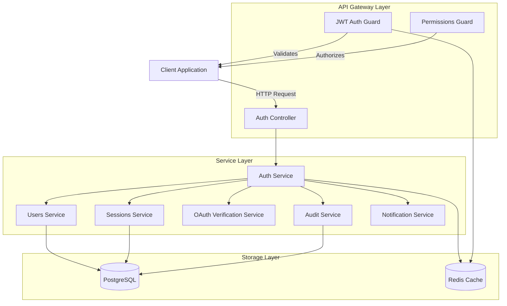

**Key Components:**
- **Auth Controller** ([`apps/api/src/identity/auth/auth.controller.ts`](apps/api/src/identity/auth/auth.controller.ts)): HTTP endpoints for authentication
- **Auth Service** ([`apps/api/src/identity/auth/auth.service.ts`](apps/api/src/identity/auth/auth.service.ts)): Core authentication logic
- **JWT Strategy** ([`apps/api/src/identity/auth/jwt.strategy.ts`](apps/api/src/identity/auth/jwt.strategy.ts)): Passport JWT validation
- **Guards**: JwtAuthGuard (authentication) + PermissionsGuard (authorization)

---

## 2. User Registration Flow

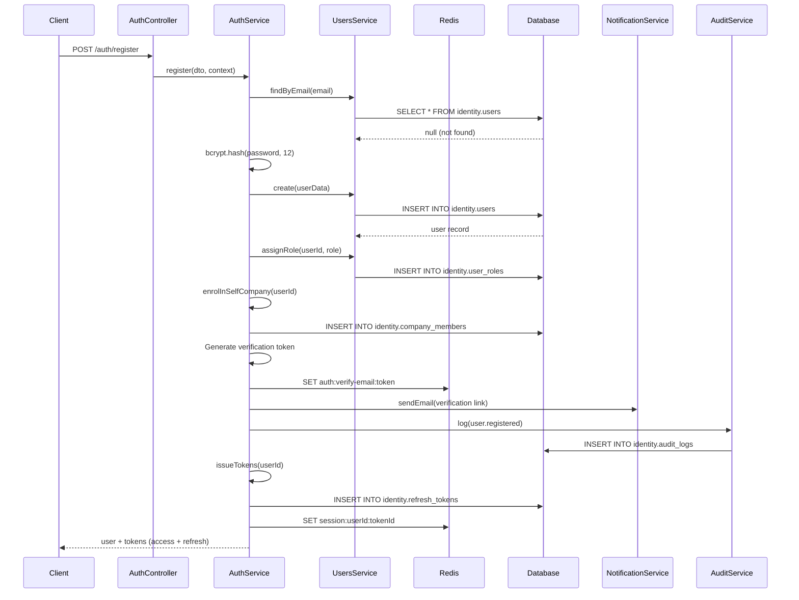

**Key Steps:**
1. Validate email not already registered
2. Hash password with bcrypt (cost factor: 12)
3. Create user record in `identity.users`
4. Assign default role (`buyer_seller`)
5. Auto-enrol in "Self" company (built-in system company)
6. Auto-accept any pending invitations for that email
7. Generate email verification token (stored in Redis, 60min TTL)
8. Send verification email
9. Audit log the registration
10. Issue JWT access token (15min) + refresh token (7 days)

---

## 3. Login Flow (Single Company)

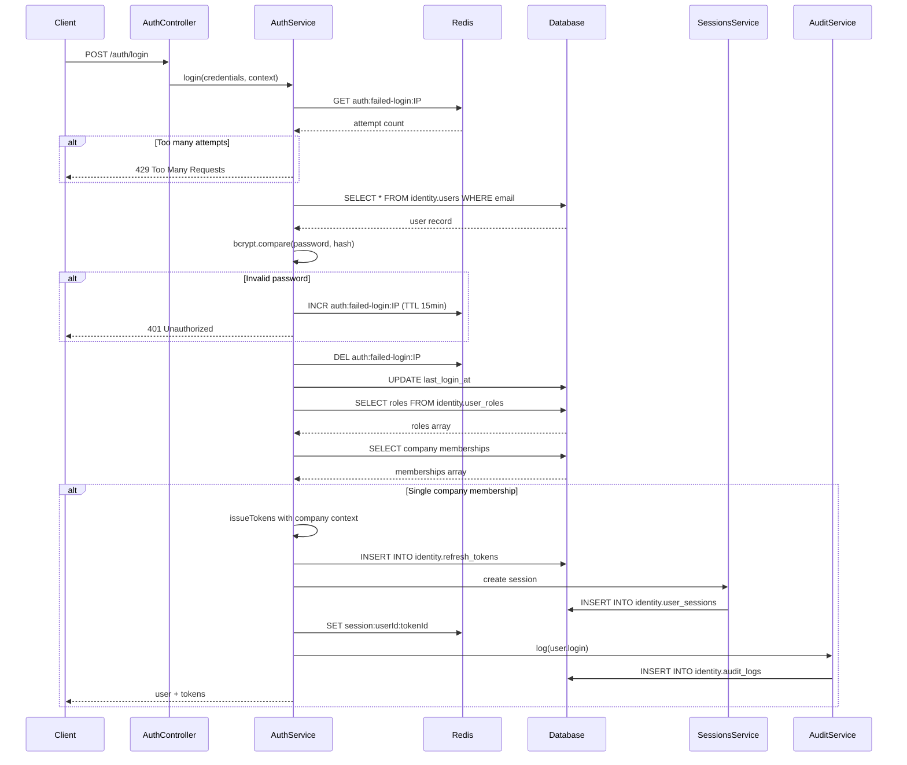

**Security Features:**
- Rate limiting: 5 failed attempts → 15min lockout
- Failed attempts tracked in Redis by IP
- Passwords hashed with bcrypt (cost 12)
- Account status check (suspended/deleted accounts rejected)
- Audit logging of all login attempts

---

## 4. Login Flow (Multi-Company - Context Selection)

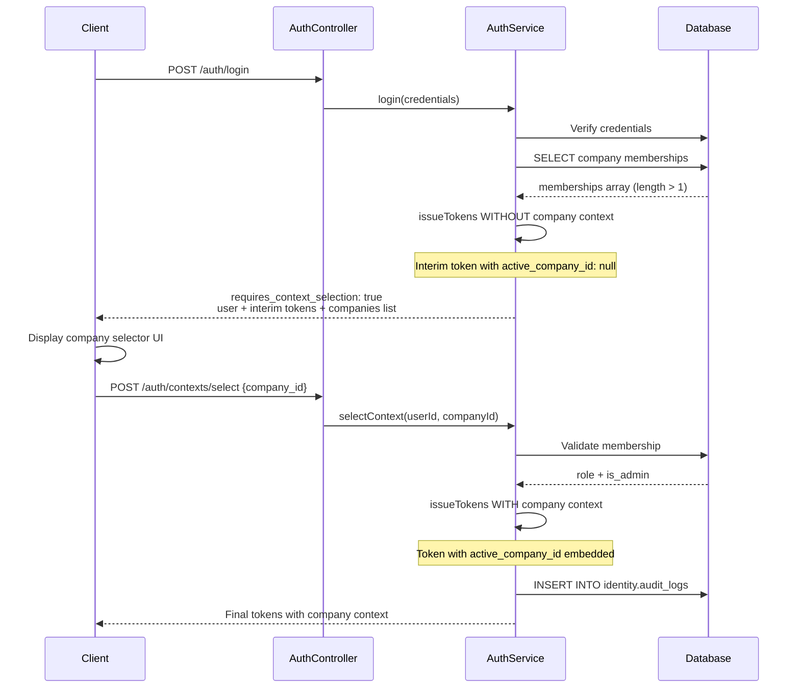

**Multi-Company Support:**
- Users can belong to multiple companies with different roles
- Initial login returns interim token (no company context)
- Client must call `/auth/contexts/select` to choose company
- Final token embeds: `active_company_id`, `active_company_role`, `active_company_is_admin`
- Company context preserved across token refreshes

---

## 5. JWT Token Structure

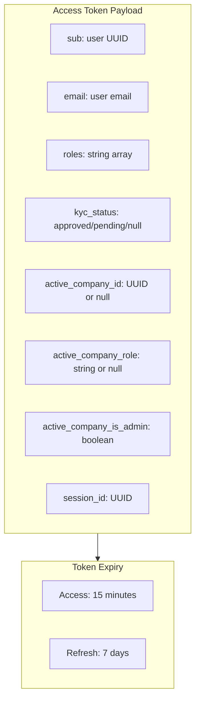

**JWT Payload Example:**
```json
{
  "sub": "550e8400-e29b-41d4-a716-446655440000",
  "email": "user@example.com",
  "roles": ["contractor", "buyer_seller"],
  "kyc_status": "approved",
  "active_company_id": "123e4567-e89b-12d3-a456-426614174000",
  "active_company_role": "contractor",
  "active_company_is_admin": false,
  "session_id": "789e4567-e89b-12d3-a456-426614174111",
  "iat": 1709251200,
  "exp": 1709252100
}
```

**Storage:**
- Access token: Stored client-side only (memory/localStorage)
- Refresh token: Hashed (SHA-256) and stored in `identity.refresh_tokens`
- Session metadata: Stored in `identity.user_sessions` + Redis cache

---

## 6. Token Refresh Flow (Rotation)

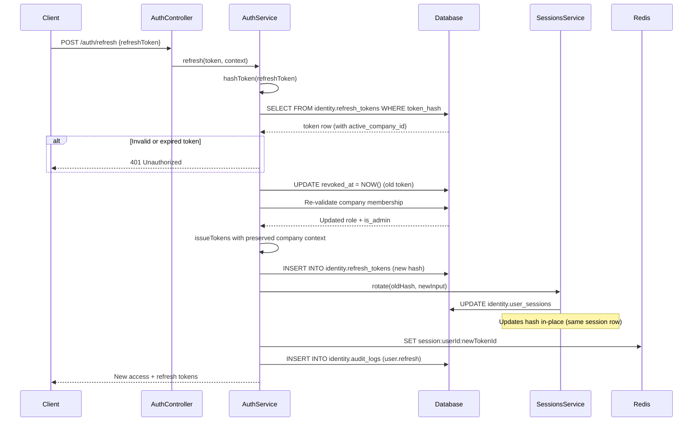

**Refresh Token Rotation:**
- Old refresh token is immediately revoked
- New refresh token issued with same company context
- Session row updated in-place (preserves device/IP metadata)
- Redis cache updated with new token mapping
- All refreshes are audit logged

---

## 7. Authentication Guard Flow

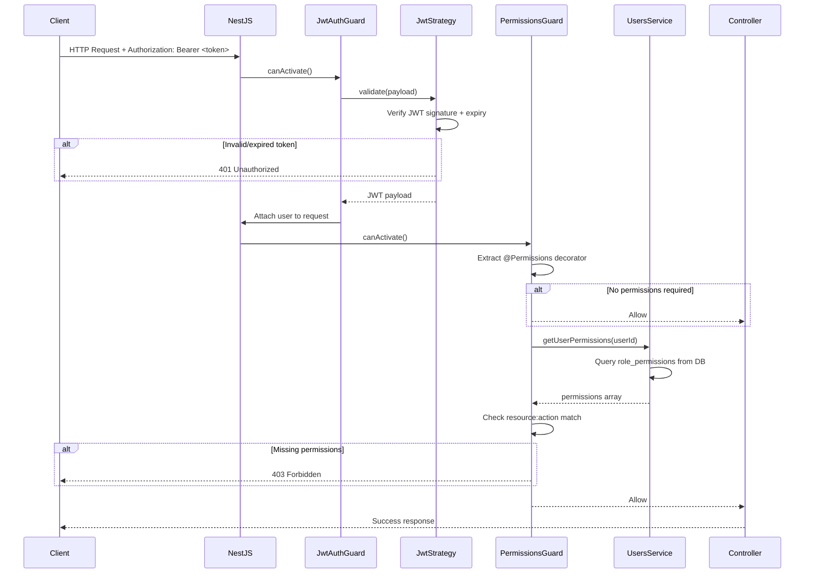

**Guard Chain:**
1. **JwtAuthGuard** (Authentication)
   - Validates JWT signature and expiry
   - Extracts payload and attaches to `req.user`
   
2. **PermissionsGuard** (Authorization)
   - Reads `@Permissions` decorator metadata
   - Fetches user's effective permissions from database
   - Checks if user has required `resource:action` permissions
   - Supports wildcard `resource:full` for admin roles

**Usage Example:**
```typescript
@UseGuards(JwtAuthGuard, PermissionsGuard)
@Permissions({ resource: 'property', action: 'create' })
@Post('properties')
createProperty() { ... }
```

---

## 8. OAuth Login Flow (Google/Apple/Facebook)

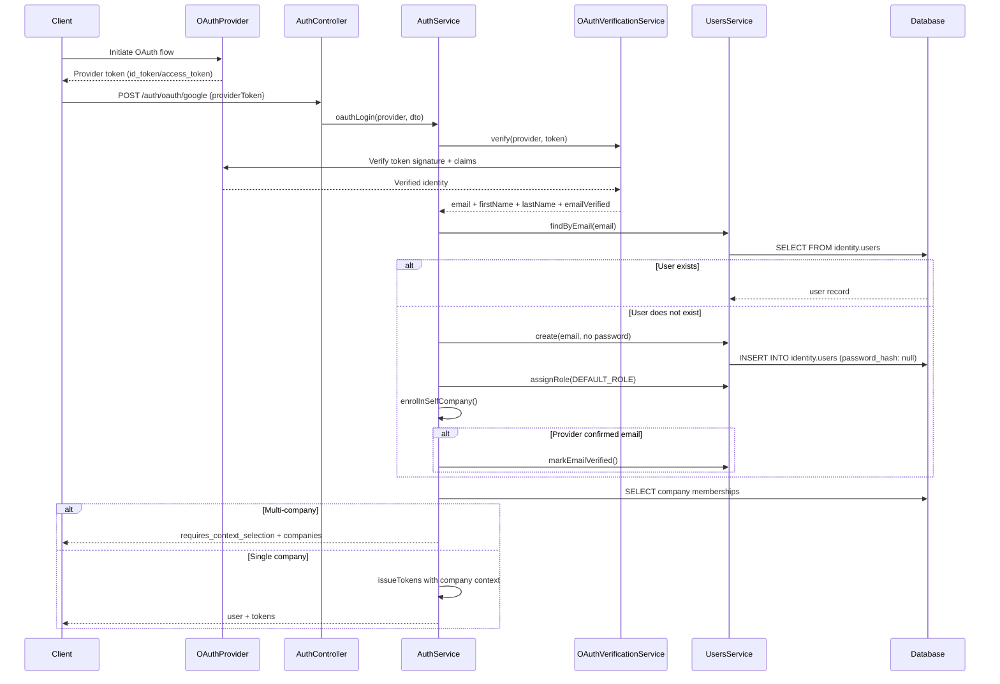

**OAuth Providers Supported:**
- Google (`/auth/oauth/google`)
- Apple (`/auth/oauth/apple`)
- Facebook (`/auth/oauth/facebook`)

**OAuth-Specific Logic:**
- Users created via OAuth have `password_hash: null`
- Email automatically verified if provider confirms it
- Token verification delegates to [`oauth-verification.service.ts`](apps/api/src/identity/auth/oauth-verification.service.ts)

---

## 9. Password Reset Flow

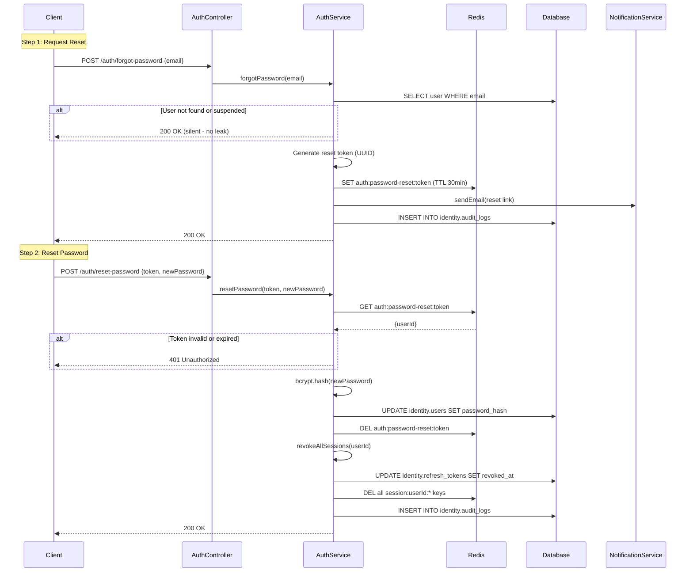

**Security Features:**
- Reset tokens stored in Redis with 30min TTL
- Silent success response (no email leak)
- All existing sessions revoked after password reset
- Audit logging of reset requests and completions

---

## 10. Email Verification Flow

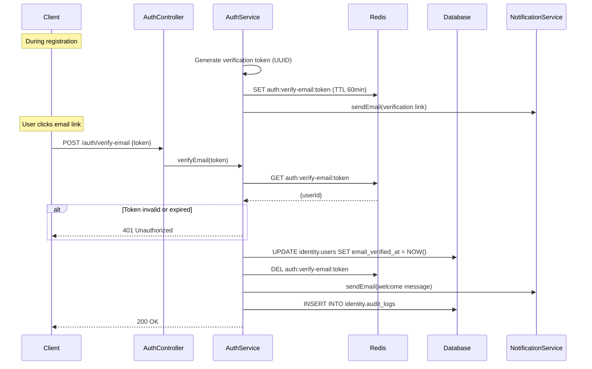

**Email Verification:**
- Token valid for 60 minutes
- Stored in Redis: `auth:verify-email:{token}`
- Welcome email sent after successful verification
- Resend endpoint available: `/auth/resend-verification-email`

---

## 11. Session Management

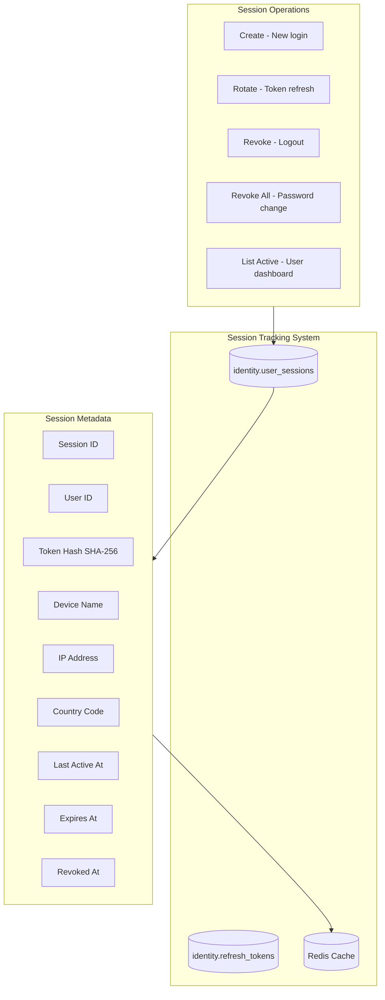

**Session Storage:**

**Database: `identity.user_sessions`**
- Persistent session records
- Tracks device, IP, country, last active time
- One row per session (updated during refresh rotation)

**Database: `identity.refresh_tokens`**
- Stores hashed refresh tokens
- Links to `user_sessions` via `session_token_hash`
- Tracks `active_company_id` for context preservation

**Redis Cache:**
- Key pattern: `session:{userId}:{refreshTokenId}`
- Stores session metadata for fast access
- TTL matches refresh token expiry (7 days)

**Session Service Operations:**
- `create()` - New session on login
- `rotate()` - Update session on token refresh (preserves session row)
- `revoke()` - Logout specific session
- `revokeAll()` - Logout all sessions (password change, suspension)
- `listActive()` - Show user their active sessions

Implementation: [`apps/api/src/identity/sessions/sessions.service.ts`](apps/api/src/identity/sessions/sessions.service.ts)

---

## 12. Database Schema

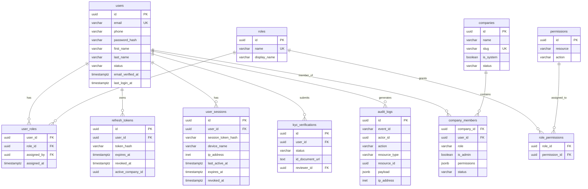

**Key Tables:**
- `identity.users` - User accounts
- `identity.roles` - 9 system roles (buyer_seller, agent, contractor, supplier, conveyancer, inspector, investor, admin, truck_operator)
- `identity.user_roles` - Many-to-many role assignments
- `identity.permissions` - Granular permissions (resource:action)
- `identity.role_permissions` - Role permission mappings
- `identity.refresh_tokens` - Hashed refresh tokens with company context
- `identity.user_sessions` - Session tracking with device/IP metadata
- `identity.companies` - Multi-company support (includes "Self" system company)
- `identity.company_members` - User-company memberships with role + permissions
- `identity.audit_logs` - Append-only audit trail

---

## 13. Role-Based Access Control (RBAC)

```mermaid
graph TB
    subgraph roles [System Roles]
        buyerSeller[buyer_seller]
        agent[agent]
        contractor[contractor]
        supplier[supplier]
        conveyancer[conveyancer]
        inspector[inspector]
        investor[investor]
        truckOperator[truck_operator]
        admin[admin]
    end
    
    subgraph permissions [Resource:Action Permissions]
        propertyRead[property:read]
        propertyCreate[property:create]
        projectCreate[project:create]
        escrowDeposit[escrow:deposit]
        escrowApprove[escrow:approve]
        usersManage[users:full]
        kycApprove[kyc:approve]
    end
    
    subgraph enforcement [Permission Enforcement]
        PermissionsGuard[Permissions Guard]
        PermissionsDecorator[@Permissions Decorator]
    end
    
    admin -->|full access| usersManage
    admin -->|full access| kycApprove
    admin -->|full access| escrowApprove
    
    agent -->|can create| propertyCreate
    contractor -->|can create| projectCreate
    buyerSeller -->|can deposit| escrowDeposit
    
    PermissionsDecorator --> PermissionsGuard
    PermissionsGuard --> permissions
```

**RBAC Permission Matrix:**

| Role | Property | Project | Escrow | Users | KYC |
|------|----------|---------|--------|-------|-----|
| **buyer_seller** | read | read | deposit | self | submit |
| **agent** | create/read/update | — | — | — | submit |
| **contractor** | read | create/update | — | — | submit |
| **supplier** | read | read | — | — | submit |
| **conveyancer** | read | — | read | — | submit |
| **inspector** | read | read | — | — | submit |
| **investor** | read | read | read | — | submit |
| **truck_operator** | — | — | — | — | submit |
| **admin** | full | full | full | full | approve |

**Implementation:**
- Permissions stored as `{resource: string, action: string}` in `identity.permissions`
- Role-permission mappings in `identity.role_permissions`
- Company members can have custom permissions in `company_members.permissions` (JSONB)
- Permissions enforced via `@Permissions` decorator + `PermissionsGuard`

**Usage Example:**
```typescript
@UseGuards(JwtAuthGuard, PermissionsGuard)
@Permissions({ resource: 'escrow', action: 'approve' })
@Post('escrow/:id/approve')
approveEscrow() { ... }
```

---

## 14. Security Measures

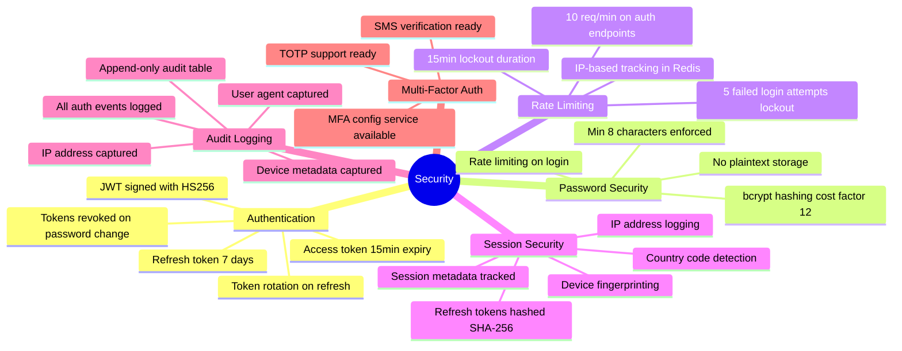

**Security Configuration:**

**Password Security:**
- Bcrypt hashing with cost factor 12
- Minimum 8 characters enforced (configurable)
- Password validation on register/reset

**Token Security:**
- JWT signed with `JWT_SECRET` (HS256)
- Access tokens expire after 15 minutes
- Refresh tokens expire after 7 days
- Refresh tokens hashed (SHA-256) before storage
- Old refresh tokens immediately revoked on rotation

**Rate Limiting:**
- Auth endpoints: 10 requests/min (via `@Throttle` decorator)
- Failed logins: 5 attempts → 15min lockout
- Lockout tracked in Redis by IP address

**Session Security:**
- Device name, IP address, country code tracked
- Session activity timestamps
- Admin can view/revoke active sessions
- All sessions revoked on password change

**Audit Logging:**
- Every auth event logged to `identity.audit_logs`
- Captured: actor, action, resource, payload, IP, user agent
- Append-only table (no UPDATE/DELETE)
- Events: `user.registered`, `user.login`, `user.logout`, `user.refresh`, `user.password_reset_requested`, `user.password_reset_completed`, `kyc.approved`, etc.

---

## 15. API Endpoints Reference

**Authentication:**
- `POST /api/v1/auth/register` - User registration
- `POST /api/v1/auth/login` - Password login (returns tokens or context selector)
- `POST /api/v1/auth/logout` - Logout (revoke refresh token)
- `POST /api/v1/auth/refresh` - Refresh access token (rotates refresh token)

**Password Management:**
- `POST /api/v1/auth/forgot-password` - Request password reset email
- `POST /api/v1/auth/reset-password` - Reset password with token
- `POST /api/v1/auth/change-password` - Change password (requires current password)

**Email Verification:**
- `POST /api/v1/auth/verify-email` - Verify email with token
- `POST /api/v1/auth/resend-verification-email` - Resend verification email

**OAuth:**
- `POST /api/v1/auth/oauth/google` - Google OAuth login
- `POST /api/v1/auth/oauth/apple` - Apple OAuth login
- `POST /api/v1/auth/oauth/facebook` - Facebook OAuth login

**Company Context (Multi-Company):**
- `GET /api/v1/auth/contexts` - List user's company memberships
- `POST /api/v1/auth/contexts/select` - Select active company context

**All auth endpoints rate-limited to 10 requests/minute.**

---

## 16. Environment Configuration

Required environment variables ([`.env.example`](.env.example)):

```bash
# JWT Configuration
JWT_SECRET=<32+ character secret>
JWT_EXPIRY=15m
REFRESH_TOKEN_EXPIRY=7d

# Password Security
BCRYPT_ROUNDS=12

# Token Expiry
EMAIL_VERIFICATION_TOKEN_EXPIRY_MINUTES=60
PASSWORD_RESET_TOKEN_EXPIRY_MINUTES=30

# Frontend URL (for email links)
FRONTEND_URL=http://localhost:3000

# Database
DATABASE_URL=postgres://...

# Redis
REDIS_URL=redis://...

# Sentry (optional)
SENTRY_DSN=
```

---

## 17. Key Files Reference

**Core Authentication:**
- [`apps/api/src/identity/auth/auth.service.ts`](apps/api/src/identity/auth/auth.service.ts) - Main authentication logic (1112 lines)
- [`apps/api/src/identity/auth/auth.controller.ts`](apps/api/src/identity/auth/auth.controller.ts) - HTTP endpoints
- [`apps/api/src/identity/auth/jwt.strategy.ts`](apps/api/src/identity/auth/jwt.strategy.ts) - JWT validation strategy
- [`apps/api/src/identity/auth/auth.types.ts`](apps/api/src/identity/auth/auth.types.ts) - Type definitions

**Guards & Authorization:**
- [`apps/api/src/identity/rbac/jwt-auth.guard.ts`](apps/api/src/identity/rbac/jwt-auth.guard.ts) - Authentication guard
- [`apps/api/src/identity/rbac/permissions.guard.ts`](apps/api/src/identity/rbac/permissions.guard.ts) - Authorization guard

**Session Management:**
- [`apps/api/src/identity/sessions/sessions.service.ts`](apps/api/src/identity/sessions/sessions.service.ts) - Session CRUD operations

**OAuth:**
- [`apps/api/src/identity/auth/oauth-verification.service.ts`](apps/api/src/identity/auth/oauth-verification.service.ts) - OAuth token verification

**Database Migrations:**
- `apps/api/prisma/migrations/202602210001_sprint02_identity_auth/migration.sql` - Auth tables
- `apps/api/prisma/migrations/202603050013_sprint02_enhanced/migration.sql` - Sessions table

**Sprint Specification:**
- [`design/sprints/sprint-02-identity-auth.md`](design/sprints/sprint-02-identity-auth.md) - Full sprint requirements

---

This comprehensive documentation covers the complete authentication architecture with all flows, security measures, and implementation details.
