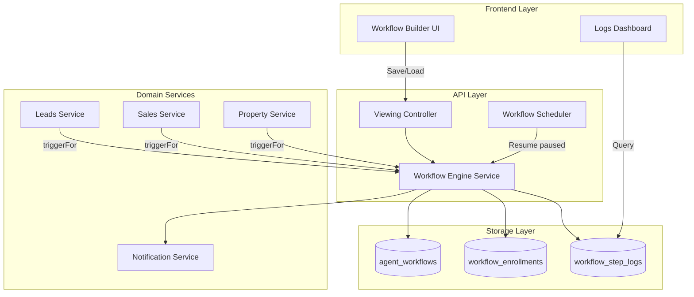
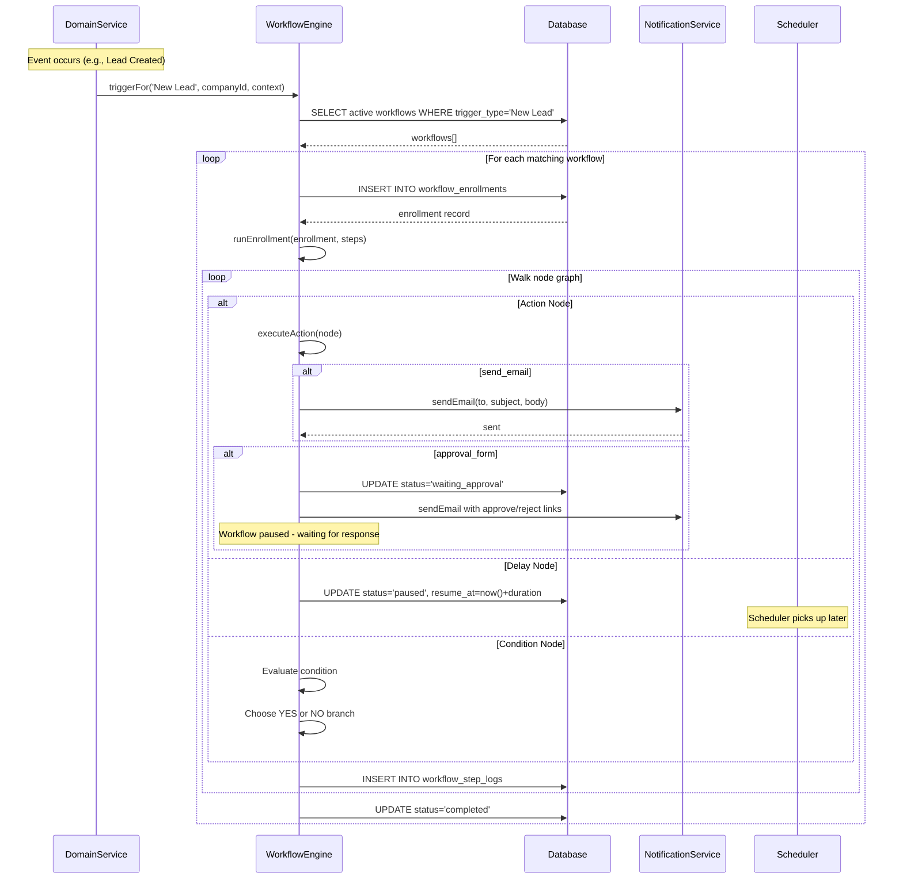
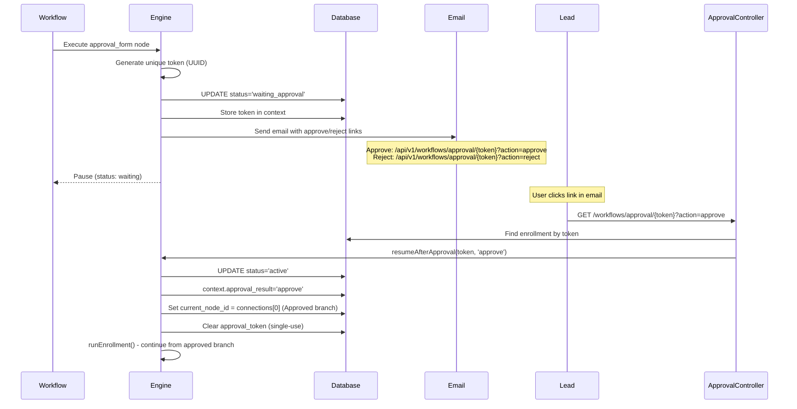

# Workflow System — Architecture & Developer Guide

## Overview

The PRIBEC workflow system enables automated workflows triggered by business events. This comprehensive guide explains the architecture, execution flow, and how to extend the system with new triggers and custom action nodes.

---

## Table of Contents

1. [System Architecture](#1-system-architecture)
2. [Architecture Diagrams](#2-architecture-diagrams)
3. [Workflow Execution Flow](#3-workflow-execution-flow)
4. [Adding New Triggers](#4-adding-new-triggers)
5. [Custom Action Nodes with Approve/Reject](#5-custom-action-nodes-with-approvereject)
6. [Adding New Custom Actions](#6-adding-new-custom-actions)
7. [Developer Expansion Guide](#7-developer-expansion-guide)
8. [Database Schema](#8-database-schema)
9. [API Endpoints](#9-api-endpoints)
10. [Best Practices](#10-best-practices)

---

## 1. System Architecture

The workflow system consists of:

### Core Components

**Backend:**
- [`apps/api/src/property/workflow-engine.service.ts`](apps/api/src/property/workflow-engine.service.ts) - Main execution engine (581 lines)
- [`apps/api/src/property/workflow-scheduler.service.ts`](apps/api/src/property/workflow-scheduler.service.ts) - Handles delayed/paused workflows
- [`apps/api/src/property/viewing.service.ts`](apps/api/src/property/viewing.service.ts) - Saves/loads workflow definitions
- [`apps/api/src/property/viewing.controller.ts`](apps/api/src/property/viewing.controller.ts) - API endpoints

**Frontend:**
- [`apps/web/src/components/open-houses/EnhancedWorkflowBuilder.tsx`](apps/web/src/components/open-houses/EnhancedWorkflowBuilder.tsx) - Drag-and-drop UI builder

**Database Schema:**
```
property.agent_workflows        - Workflow definitions
property.workflow_enrollments  - Individual workflow runs
property.workflow_step_logs     - Execution logs per step
```

### Node Types

1. **Trigger** - Entry point (e.g., "New Lead", "Form Submit", "Sale Initiated")
2. **Action** - Executes something (send_email, send_sms, create_task, add_tag, approval_form)
3. **Delay** - Pauses workflow for N hours/days
4. **Condition** - If/Then branching based on context data

---

## 2. Architecture Diagrams

### High-Level System Architecture



**Key Components:**
- **Workflow Engine** - Core execution engine that runs workflow nodes
- **Workflow Scheduler** - Cron-based service that resumes paused workflows (delays)
- **Domain Services** - Fire triggers when business events occur
- **Notification Service** - Sends emails/SMS for action nodes
- **Database Tables** - Store workflow definitions, enrollments, and execution logs

---

## 3. Workflow Execution Flow



**Execution Steps:**

1. **Trigger Fires** - Domain service calls `workflowEngine.triggerFor(label, companyId, context)`
2. **Find Workflows** - Engine queries active workflows matching the trigger label
3. **Create Enrollment** - One enrollment record per workflow run per lead
4. **Walk Graph** - Starting from first node after trigger, execute each node sequentially
5. **Execute Actions** - Send emails, create tasks, pause for approval, etc.
6. **Handle Delays** - Pause workflow and set `resume_at` timestamp for scheduler
7. **Branching** - Condition nodes choose YES/NO branch based on enrollment context
8. **Log Steps** - Every node execution logged to `workflow_step_logs`
9. **Complete** - Mark enrollment as completed when no more nodes to execute

---

## 4. Adding New Triggers

### Example: "Sale Initiated" Trigger

This example shows how to add a new trigger that fires when a property sale is initiated.

### Step 1: Fire Trigger in Domain Service

In [`apps/api/src/sales/sales.service.ts`](apps/api/src/sales/sales.service.ts):

```typescript
// 1. Inject WorkflowEngineService in constructor
constructor(
  private readonly prisma: PrismaService,
  private readonly auditService: AuditService,
  private readonly workflowEngine: WorkflowEngineService,  // ← ADD THIS
) {}

// 2. After sale creation, fire the trigger
async initiateSale(dto: CreateSaleDto, userId: string, companyId: string) {
  // ... existing sale creation code ...
  
  // Fire workflow trigger (non-blocking)
  if (this.workflowEngine) {
    this.workflowEngine
      .triggerFor('Sale Initiated', companyId, {
        leadId: sale.buyer_id,
        leadEmail: buyer.email,
        leadName: `${buyer.first_name} ${buyer.last_name}`,
        context: {
          saleId: sale.id,
          propertyId: sale.property_id,
          propertyAddress: property.address,
          agreedPrice: sale.agreed_price,
          saleReference: sale.reference,
          saleDate: sale.created_at.toISOString(),
        },
      })
      .catch((err) => this.logger.warn(`Workflow trigger failed: ${err.message}`));
  }
  
  return sale;
}
```

**Key Points:**
- Trigger label string: `'Sale Initiated'` (must match UI template exactly)
- Use `.catch()` to prevent workflow errors from blocking the sale
- Pass rich context data for use in workflow actions

### Step 2: Add Trigger Template to UI

In [`apps/web/src/components/open-houses/EnhancedWorkflowBuilder.tsx`](apps/web/src/components/open-houses/EnhancedWorkflowBuilder.tsx), add to `nodeTemplates.triggers`:

```typescript
{
  id: 'sale_initiated',           // Internal UI key
  type: 'trigger',
  label: 'Sale Initiated',        // ← MUST MATCH triggerFor() string
  description: 'When a property sale is initiated',
  icon: Target,                   // lucide-react icon
  color: '#059669',
  bgColor: '#f0fdf4',
  borderColor: '#059669',
},
```

**Important:** The `label` field must exactly match the string passed to `triggerFor()` (case-insensitive match).

### Step 3: Ensure Service is Injected

In [`apps/api/src/sales/sales.module.ts`](apps/api/src/sales/sales.module.ts):

```typescript
import { PropertyModule } from '../property/property.module';

@Module({
  imports: [PropertyModule],  // ← WorkflowEngineService exported from PropertyModule
  providers: [SalesService],
  controllers: [SalesController],
})
export class SalesModule {}
```

### Step 4: Extend Context Type (if needed)

Update [`apps/api/src/property/workflow-engine.service.ts`](apps/api/src/property/workflow-engine.service.ts) signature:

```typescript
async triggerFor(
  triggerType: string,
  companyId: string,
  context: {
    leadId?: string;
    leadEmail?: string | null;
    leadName?: string | null;
    context?: Record<string, unknown>;  // ← Custom data bag
  },
): Promise<void> {
```

Update enrollment insertion:

```typescript
const [enrollment] = await this.prisma.$queryRaw<EnrollmentRow[]>`
  INSERT INTO property.workflow_enrollments
    (workflow_id, company_id, lead_id, lead_email, lead_name, current_node_id, context)
  VALUES (
    ${workflow.id}::uuid,
    ${companyId}::uuid,
    ${context.leadId ?? null}::uuid,
    ${context.leadEmail ?? null},
    ${context.leadName ?? null},
    ${firstNodeId},
    ${JSON.stringify(context.context ?? {})}::jsonb  // ← Store custom context
  )
  RETURNING *
`;
```

**Result:** Agents can now create workflows that trigger when a sale is initiated!

---

## 5. Custom Action Nodes with Approve/Reject

The system already has a built-in `approval_form` action that pauses workflows and waits for user approval/rejection.

### Architecture



**How It Works:**

1. **Approval node executes** → Generates unique token
2. **Workflow pauses** → Status set to `waiting_approval`
3. **Email sent** → Contains approve and reject links with token
4. **User clicks link** → Public endpoint receives token and action
5. **Workflow resumes** → Continues from correct branch (approve/reject)
6. **Token cleared** → Single-use security (token = null after use)

### Implementation

In [`apps/api/src/property/workflow-engine.service.ts`](apps/api/src/property/workflow-engine.service.ts), line 400-451:

```typescript
case 'approval_form': {
  const formTitle    = (node.config?.formTitle    as string) ?? 'Action Required';
  const message      = (node.config?.message      as string) ?? 'Please review and respond.';
  const approveLabel = (node.config?.approveLabel as string) ?? 'Approve';
  const rejectLabel  = (node.config?.rejectLabel  as string) ?? 'Reject';
  const to = enrollment.lead_email ?? '';

  if (dryRun) {
    return { ...base, message: `Would send approval form "${formTitle}" to ${to}` };
  }

  const token   = randomUUID();
  const baseUrl = process.env.API_BASE_URL ?? 'http://localhost:3001/api/v1';
  const approveUrl = `${baseUrl}/workflows/approval/${token}?action=approve`;
  const rejectUrl  = `${baseUrl}/workflows/approval/${token}?action=reject`;

  // Pause enrollment
  await this.prisma.$executeRaw`
    UPDATE property.workflow_enrollments
    SET status  = 'waiting_approval',
        context = ${JSON.stringify({
          ...enrollment.context,
          approval_token:   token,
          approval_node_id: node.id,
        })}::jsonb
    WHERE id = ${enrollment.id}::uuid
  `;

  // Send email with approve/reject links
  const emailBody = [
    `Hi ${enrollment.lead_name ?? 'there'},`,
    '',
    message,
    '',
    `✅ ${approveLabel}: ${approveUrl}`,
    `❌ ${rejectLabel}:  ${rejectUrl}`,
    '',
    'This link can only be used once.',
  ].join('\n');
  
  await this.notificationService.sendEmail(to, formTitle, emailBody);
  
  return { ...base, status: 'waiting', message: `Approval form sent to ${to}` };
}
```

### Resume Logic (line 461-525)

```typescript
async resumeAfterApproval(token: string, action: 'approve' | 'reject'): Promise<void> {
  // Find enrollment by token
  const rows = await this.prisma.$queryRaw`
    SELECT e.*, w.steps
    FROM property.workflow_enrollments e
    JOIN property.agent_workflows w ON w.id = e.workflow_id
    WHERE e.status = 'waiting_approval'
      AND e.context->>'approval_token' = ${token}
    LIMIT 1
  `;

  if (rows.length === 0) {
    throw new Error('Approval link not found or already used');
  }

  const enrollment = rows[0];
  const steps = this.parseSteps(enrollment.steps);
  const approvalNode = steps.find(n => n.id === enrollment.context.approval_node_id);

  // connections[0] = Approved branch
  // connections[1] = Rejected branch
  const nextNodeId = action === 'approve'
    ? approvalNode.connections[0]
    : approvalNode.connections[1];

  // Update enrollment and clear token
  await this.prisma.$executeRaw`
    UPDATE property.workflow_enrollments
    SET status = 'active',
        current_node_id = ${nextNodeId},
        context = ${JSON.stringify({
          ...enrollment.context,
          approval_token: null,  // Clear token (single-use)
          approval_result: action,
          approval_responded_at: new Date().toISOString(),
        })}::jsonb
    WHERE id = ${enrollment.id}::uuid
  `;

  // Log the approval step
  await this.logStep(enrollment.id, approvalNode, 'executed', {
    action,
    responded_at: new Date().toISOString(),
    next_node_id: nextNodeId,
  });

  // Resume workflow from chosen branch
  this.runEnrollment(enrollment, steps);
}
```

### UI Configuration (already exists)

In [`apps/web/src/components/open-houses/EnhancedWorkflowBuilder.tsx`](apps/web/src/components/open-houses/EnhancedWorkflowBuilder.tsx):

```typescript
// Already in nodeTemplates.actions
{
  id: 'approval_form',
  type: 'action',
  label: 'Approval Form',
  description: 'Pause & wait for approve/reject response',
  icon: CheckSquare,
  color: '#0ea5e9',
  bgColor: '#f0f9ff',
  borderColor: '#0ea5e9',
},
```

**Configuration Panel** automatically renders custom fields for:
- Form Title
- Message
- Approve Label (button text)
- Reject Label (button text)

---

## 6. Adding New Custom Actions

### Example: "Send WhatsApp" Action

#### Step 1: Add to UI Template

In [`apps/web/src/components/open-houses/EnhancedWorkflowBuilder.tsx`](apps/web/src/components/open-houses/EnhancedWorkflowBuilder.tsx):

```typescript
// Add to nodeTemplates.actions
{
  id: 'send_whatsapp',           // ← This is the templateId
  type: 'action',
  label: 'Send WhatsApp',
  description: 'Send WhatsApp message',
  icon: MessageSquare,
  color: '#25d366',
  bgColor: '#f0fdf4',
  borderColor: '#25d366',
},
```

#### Step 2: Add Engine Handler

In [`apps/api/src/property/workflow-engine.service.ts`](apps/api/src/property/workflow-engine.service.ts), add to `executeAction()`:

```typescript
case 'send_whatsapp': {
  const message = (node.config?.message as string) ?? 'Hello!';
  const phone = enrollment.context?.phone as string ?? '';

  if (dryRun) {
    return { ...base, message: `Would send WhatsApp to ${phone}: "${message}"` };
  }

  if (!phone) {
    return { ...base, status: 'skipped', message: 'No phone number - skipped' };
  }

  // Call WhatsApp API (e.g., Twilio, WhatsApp Business API)
  try {
    await this.whatsappService.send(phone, message);
    return { ...base, message: `WhatsApp sent to ${phone}` };
  } catch (err) {
    return { ...base, status: 'failed', message: `WhatsApp failed: ${err.message}` };
  }
}
```

#### Step 3: Add Configuration UI

In `ConfigurationPanel` component within `EnhancedWorkflowBuilder.tsx`:

```tsx
{node.type === 'action' && node.templateId === 'send_whatsapp' && (
  <div className="space-y-4">
    <div>
      <label className="block text-sm font-medium text-slate-700 mb-2">
        Message
      </label>
      <textarea
        value={node.config.message || ''}
        onChange={(e) => onUpdate({ 
          config: { ...node.config, message: e.target.value } 
        })}
        placeholder="Enter your WhatsApp message..."
        className="w-full px-3 py-2 border border-slate-200 rounded-lg focus:ring-2 focus:ring-blue-500"
        rows={4}
      />
      <p className="text-xs text-slate-500 mt-1">
        Variables: {'{{name}}'}, {'{{phone}}'}, {'{{propertyAddress}}'}
      </p>
    </div>
  </div>
)}
```

**Result:** Users can now drag "Send WhatsApp" onto the canvas and configure the message!

---

## 7. Developer Expansion Guide

### When to Extend the Workflow System

1. **New Business Events** - Any domain event that should trigger automation
   - Property viewed, offer submitted, inspection scheduled, etc.
   
2. **New Communication Channels** - Additional ways to reach leads/clients
   - SMS, WhatsApp, Slack, push notifications, webhooks
   
3. **New Integrations** - Connect to external systems
   - CRM sync, calendar events, Zapier, Stripe, DocuSign
   
4. **Complex Logic** - Advanced workflow patterns
   - Multi-step approvals, parallel branches, loops, external API calls

### Extension Checklist

When adding a new trigger or action, follow these steps:

- [ ] **Backend: Add trigger point** in domain service with `workflowEngine.triggerFor()`
- [ ] **Backend: Inject WorkflowEngineService** in module providers
- [ ] **Backend: Add action handler** in `workflow-engine.service.ts` `executeAction()`
- [ ] **Frontend: Add template** to `nodeTemplates.triggers` or `nodeTemplates.actions`
- [ ] **Frontend: Add config UI** in `ConfigurationPanel` if node needs configuration
- [ ] **Database: Extend context** if passing custom data via `context` JSONB field
- [ ] **Testing: Add test run** to verify dry-run behavior
- [ ] **Testing: Create real trigger** to test live execution
- [ ] **Documentation: Update trigger list** in workflow-trigger-guide.md

---

## 8. Database Schema

```sql
-- Workflow definitions
CREATE TABLE property.agent_workflows (
  id              uuid PRIMARY KEY,
  company_id      uuid NOT NULL,
  created_by      uuid NOT NULL,
  name            text NOT NULL,
  description     text,
  status          text NOT NULL DEFAULT 'draft' 
                  CHECK (status IN ('active', 'inactive', 'draft')),
  trigger_type    text NOT NULL DEFAULT '',  -- Label of trigger node
  steps           jsonb NOT NULL DEFAULT '[]',  -- Array of WorkflowNode
  enrolled_count  integer NOT NULL DEFAULT 0,
  completed_count integer NOT NULL DEFAULT 0,
  performance     jsonb NOT NULL DEFAULT '{"sent":0,"opened":0,"clicked":0}',
  created_at      timestamptz NOT NULL DEFAULT now(),
  updated_at      timestamptz NOT NULL DEFAULT now()
);

-- Individual workflow runs (enrollments)
CREATE TABLE property.workflow_enrollments (
  id              uuid PRIMARY KEY,
  workflow_id     uuid NOT NULL REFERENCES property.agent_workflows(id) ON DELETE CASCADE,
  company_id      uuid NOT NULL,
  lead_id         uuid,
  lead_email      text,
  lead_name       text,
  status          text NOT NULL DEFAULT 'active'
                  CHECK (status IN ('active', 'paused', 'completed', 'cancelled', 'failed', 'waiting_approval')),
  current_node_id text,         -- Graph node ID to execute next
  resume_at       timestamptz,  -- When to resume after delay
  context         jsonb NOT NULL DEFAULT '{}',  -- Custom data bag
  created_at      timestamptz NOT NULL DEFAULT now(),
  updated_at      timestamptz NOT NULL DEFAULT now()
);

-- Step execution logs
CREATE TABLE property.workflow_step_logs (
  id              uuid PRIMARY KEY,
  enrollment_id   uuid NOT NULL REFERENCES property.workflow_enrollments(id) ON DELETE CASCADE,
  step_node_id    text NOT NULL,
  step_type       text NOT NULL,
  step_label      text,
  status          text NOT NULL CHECK (status IN ('executed', 'skipped', 'failed', 'waiting')),
  result          jsonb NOT NULL DEFAULT '{}',
  executed_at     timestamptz NOT NULL DEFAULT now()
);

-- Indexes
CREATE INDEX idx_wf_enrollments_workflow ON property.workflow_enrollments (workflow_id);
CREATE INDEX idx_wf_enrollments_status ON property.workflow_enrollments (status);
CREATE INDEX idx_wf_enrollments_resume ON property.workflow_enrollments (resume_at) WHERE status = 'paused';
CREATE INDEX idx_wf_step_logs_enrollment ON property.workflow_step_logs (enrollment_id);
```

**Key Fields:**

- `agent_workflows.trigger_type` - Label of trigger node (case-insensitive match)
- `agent_workflows.steps` - JSONB array of WorkflowNode objects (graph definition)
- `workflow_enrollments.context` - JSONB bag for custom data passed through workflow
- `workflow_enrollments.current_node_id` - Which node to execute next (graph traversal)
- `workflow_enrollments.resume_at` - Timestamp for delay node resumption
- `workflow_step_logs.result` - JSONB with execution details (message, error, etc.)

---

## 9. API Endpoints

### Workflow Management

**List workflows for company:**
```
GET /api/v1/open-houses/:id/workflows
```

**Create workflow:**
```
POST /api/v1/open-houses/:id/workflows
Body: { name, status, triggerType, steps }
```

**Update workflow:**
```
PATCH /api/v1/open-houses/:id/workflows/:workflowId
Body: { name?, status?, steps? }
```

**Delete workflow:**
```
DELETE /api/v1/open-houses/:id/workflows/:workflowId
```

**Test run (dry-run):**
```
POST /api/v1/open-houses/:id/workflows/:workflowId/test-run
Body: { steps? }  // Optional: test unsaved canvas state
```

**Get execution logs:**
```
GET /api/v1/open-houses/:id/workflows/:workflowId/logs
```

### Approval Endpoint (Public)

**Handle approval/rejection:**
```
GET /api/v1/workflows/approval/:token?action=approve|reject
```

This endpoint is public (no authentication) and uses single-use tokens for security.

---

## 10. Best Practices

### Trigger Implementation

1. **Always use try-catch** around `triggerFor()` - don't block main business logic
   ```typescript
   this.workflowEngine.triggerFor(...).catch(err => 
     this.logger.warn(`Workflow trigger failed: ${err.message}`)
   );
   ```

2. **Pass rich context** - include all relevant IDs and display fields
   ```typescript
   context: {
     saleId: sale.id,
     propertyId: sale.property_id,
     propertyAddress: property.address,  // ← Good for email templates
     agreedPrice: sale.agreed_price,
     // ... more context
   }
   ```

3. **Use meaningful labels** - trigger labels must match exactly (case-insensitive)
   ```typescript
   triggerFor('Sale Initiated', ...)  // Backend
   label: 'Sale Initiated'            // Frontend template - MUST MATCH
   ```

### Action Node Implementation

4. **Make actions idempotent** - workflows may retry on failure
   - Check if action already completed before executing
   - Use `ON CONFLICT DO NOTHING` for database inserts

5. **Handle dry-run mode** - always check `dryRun` parameter
   ```typescript
   if (dryRun) {
     return { ...base, message: 'Would send email to user@example.com' };
   }
   ```

6. **Log everything** - step logs are critical for debugging
   - Execution result stored in `workflow_step_logs.result`
   - Message shown in UI logs panel

7. **Graceful failures** - log warnings instead of throwing errors
   ```typescript
   try {
     await externalApi.call();
   } catch (err) {
     this.logger.warn(`External API failed: ${err.message}`);
     return { ...base, status: 'skipped', message: 'External API unavailable' };
   }
   ```

### Security

8. **Single-use tokens** - approval tokens cleared after first use
   ```typescript
   approval_token: null  // Set to null after processing
   ```

9. **Sanitize email content** - prevent injection attacks
   ```typescript
   const sanitizedMessage = message.replace(/<script>/gi, '');
   ```

10. **Validate node configuration** - check required fields
    ```typescript
    if (!node.config?.subject) {
      return { ...base, status: 'skipped', message: 'Email subject is required' };
    }
    ```

### Testing

11. **Test dry-run first** - use Test Run button before activating
    - Simulates execution without side effects
    - Shows what each node would do

12. **Test with real data** - create actual trigger to verify live execution
    - Check workflow logs for any errors
    - Verify emails sent, tasks created, etc.

13. **Monitor performance** - track workflow metrics
    - `enrolled_count` - How many times triggered
    - `completed_count` - How many completed successfully
    - `performance` - Emails sent/opened/clicked

---

## Complete Example: Sale Initiated Workflow

This complete example shows how to create a "Sale Initiated" workflow:

### Backend Changes

**1. Fire trigger in `sales.service.ts`:**
```typescript
this.workflowEngine.triggerFor('Sale Initiated', companyId, {
  leadId: sale.buyer_id,
  leadEmail: buyer.email,
  leadName: `${buyer.first_name} ${buyer.last_name}`,
  context: {
    saleId: sale.id,
    propertyId: sale.property_id,
    propertyAddress: property.address,
    agreedPrice: sale.agreed_price,
    saleReference: sale.reference,
  },
});
```

### Frontend Changes

**2. Add trigger template to `EnhancedWorkflowBuilder.tsx`:**
```typescript
{
  id: 'sale_initiated',
  type: 'trigger',
  label: 'Sale Initiated',
  description: 'When a property sale is initiated',
  icon: Target,
  color: '#059669',
  bgColor: '#f0fdf4',
  borderColor: '#059669',
},
```

### Result

Agents can now create workflows like:

```
Trigger: "Sale Initiated"
  ↓
Action: Send Email
  Subject: "Your Sale is Confirmed!"
  Body: "Hi {{name}}, your sale for {{propertyAddress}} is confirmed. Reference: {{saleReference}}"
  ↓
Delay: Wait 2 days
  ↓
Condition: If deposit received
  ├─ YES → Send Email: "Thanks for your deposit!"
  └─ NO → Create Task: "Follow up on deposit from {{name}}"
```

---

## Additional Resources

- **Existing Guide:** [`docs/workflow-trigger-guide.md`](docs/workflow-trigger-guide.md) - Step-by-step tutorial for junior developers
- **Engine Implementation:** [`apps/api/src/property/workflow-engine.service.ts`](apps/api/src/property/workflow-engine.service.ts)
- **UI Builder:** [`apps/web/src/components/open-houses/EnhancedWorkflowBuilder.tsx`](apps/web/src/components/open-houses/EnhancedWorkflowBuilder.tsx)
- **Scheduler:** [`apps/api/src/property/workflow-scheduler.service.ts`](apps/api/src/property/workflow-scheduler.service.ts)

---

This comprehensive guide provides everything needed to understand and extend the PRIBEC workflow system. For specific implementation details, refer to the linked source files and existing documentation.
